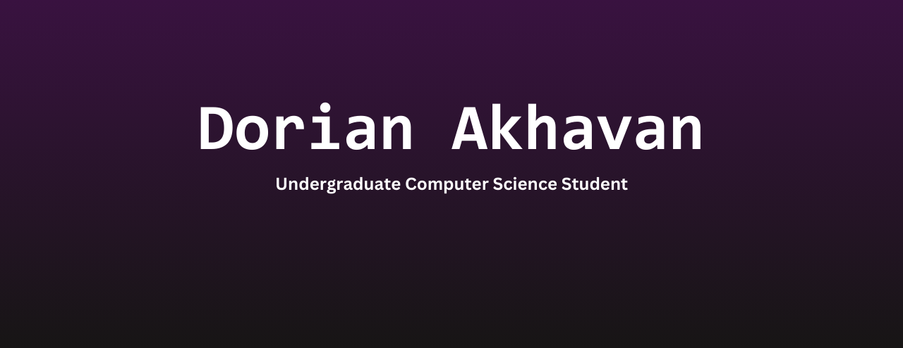

  

**Hey! Here's a bit about me:**
 
📜 Undergraduate Computer Science student at UNLV!  
👌 Pronouns they/them  
🐛 Check out my website [here!](https://www.dorianakhavan.dev)

---

## Currently Studying
🛠️ Software Product Design and Development ➡️ Project source available [here!](https://github.com/UNLV-CS472-672/2025-S-GROUP2-LessonConnect)  
🐍 Analysis and Presentation (Computational Statistical Analysis)  
💪 Independent Study (Transpiler Construction) ➡️ Project source available [here!](https://github.com/omgdory/CS490)  
📊 Statistics for Scientists and Engineers II  

## Tools and Skills

 
Also x86 and MIPS (RISC) Assembly!

## Completed Courses
🖥️ Computer Science I and II  
⚙ Introduction to Systems Programming  
🔍 Data Structures and Algorithms  
💿 Computer Organization  
💾 Operating Systems  
👨🏽‍💻 Programming Languages, Concepts, and Implementation  
🌎 Social Implications of Computer Technology  
🧠 Introduction to Machine Learning  
🎯 Analysis of Algorithms  
💡 Formal Language and Automata  
🧭 Compiler Construction  
🛜 Computer Networks  
ℹ️ Database Management Systems  

<!--
**omgdory/omgdory** is a ✨ _special_ ✨ repository because its `README.md` (this file) appears on your GitHub profile.

Here are some ideas to get you started:

- 🔭 I’m currently working on ...
- 🌱 I’m currently learning ...
- 👯 I’m looking to collaborate on ...
- 🤔 I’m looking for help with ...
- 💬 Ask me about ...
- 📫 How to reach me: ...
- 😄 Pronouns: ...
- ⚡ Fun fact: ...
-->
