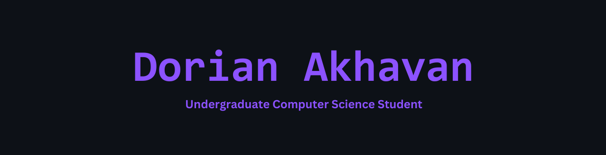

  

**Hey! Here's a bit about me:**
 
📜 Undergraduate Computer Science student at UNLV!  
👌 Pronouns they/them  
🐛 Check out my website [here!](https://www.dorianakhavan.dev)

---

## Currently Studying
🧭 Compiler Construction  
🛜 Computer Networks  
ℹ️ Database Management Systems  

## Tools and Skills

 
Also x86 and MIPS (RISC) Assembly!

## Completed Courses
🖥️ Computer Science I and II  
⚙ Introduction to Systems Programming  
🔠Data Structures and Algorithms  
💿 Computer Organization  
💾 Operating Systems  
👨🏽‍💻 Programming Languages, Concepts, and Implementation  
🌠Social Implications of Computer Technology  
🧠 Introduction to Machine Learning  
🯠Analysis of Algorithms  
💡 Formal Language and Automata

<!--
**omgdory/omgdory** is a ✨ _special_ ✨ repository because its `README.md` (this file) appears on your GitHub profile.

Here are some ideas to get you started:

- 🔭 I’m currently working on ...
- 🌱 I’m currently learning ...
- 👯 I’m looking to collaborate on ...
- 🤔 I’m looking for help with ...
- 💬 Ask me about ...
- 📫 How to reach me: ...
- 😄 Pronouns: ...
- ⚡ Fun fact: ...
-->
